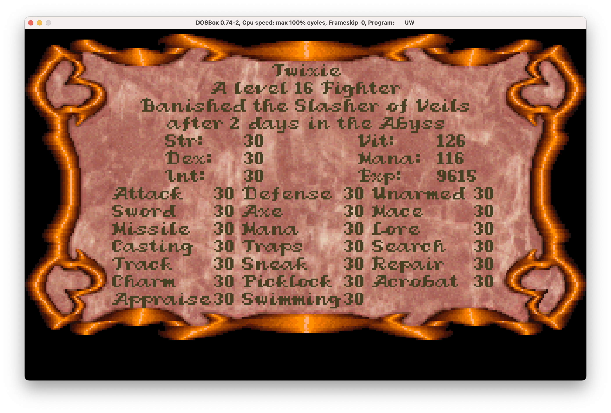

# UW_character_mod
A quick typescript project that decodes the save files of Ultima Underworld character saves.

# how to run
1. find the location of the Ultima Underworld folder. on Mac would be /Applications/Ultima™  Underworld I.app/Contents/Resources/game/UNDEROM1 if you got it from GOG

2. clone the repo to this location and run npm i to install dependencies
3. run ts-node src/index.ts will set your char to be level 30 for all your stats. (see attachment for a full stat at the end game)

